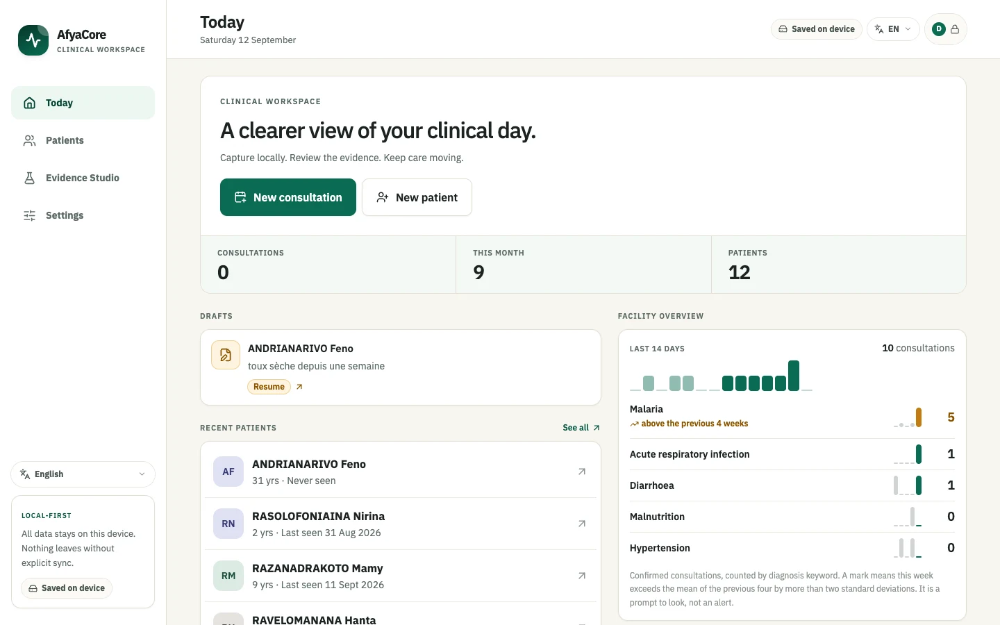
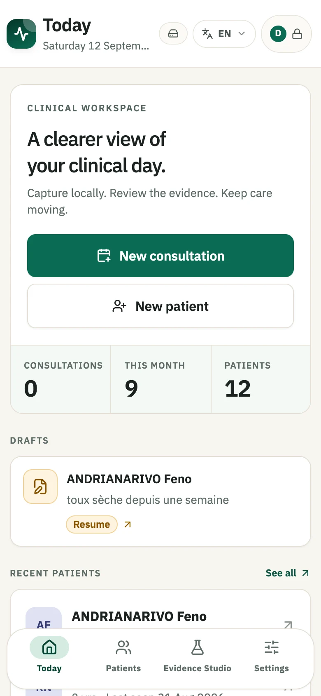
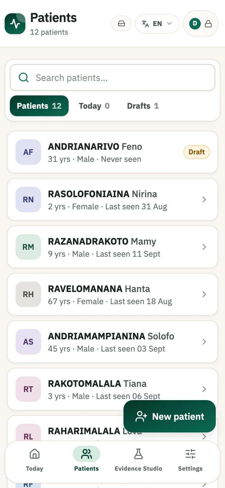
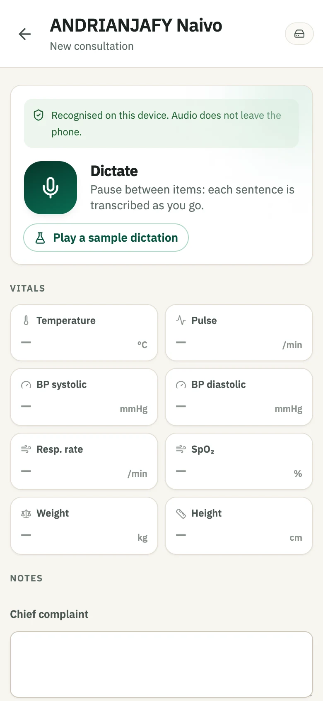
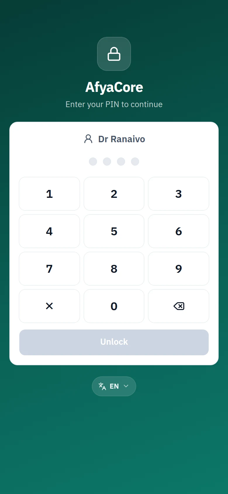
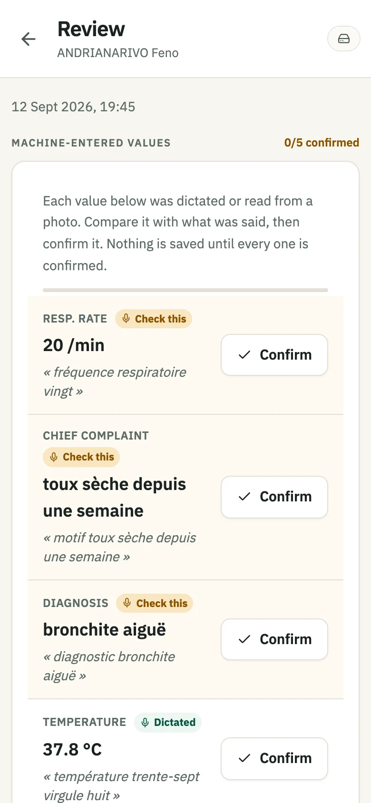
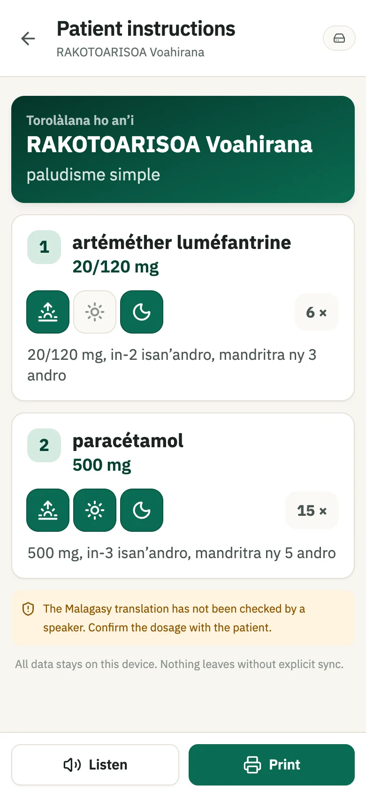
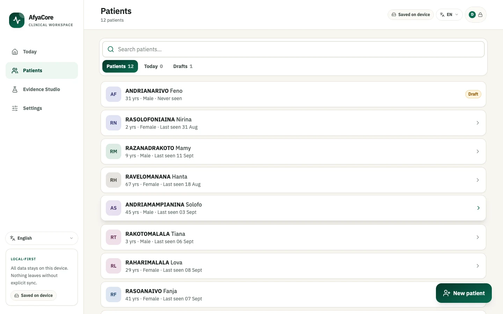
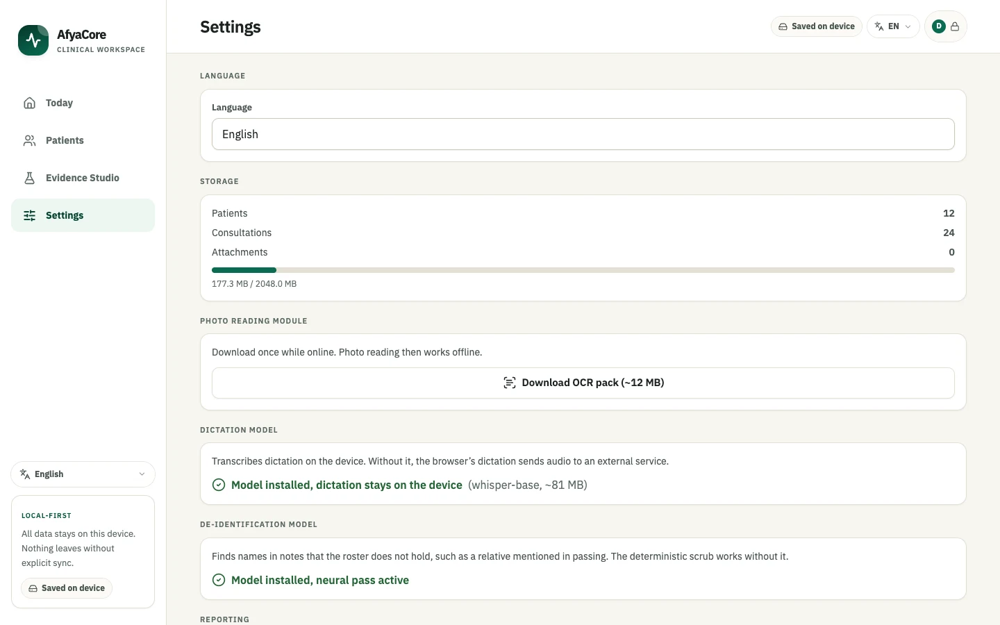

<h1 align="center">AfyaCore</h1>

<p align="center">
  <strong>Offline-first clinical data capture for health facilities in Madagascar.</strong><br>
  A phone that works with no connectivity, no server and no account,<br>
  and gives the patient something they can actually read on the way out.
</p>

<p align="center">
  <a href="https://github.com/SyedMohammedSameer/AfyaCore/actions/workflows/ci.yml"></a>
  <a href="LICENSE"></a>
  
  
  
</p>

<p align="center">
  
</p>

> **Status: pilot candidate.** Not yet validated with a facility or an NGO. The sync server now
> authenticates devices and keeps a tamper-evident audit trail; records are still stored unencrypted
> on the device. See [Known limits](#known-limits) and [SECURITY.md](SECURITY.md).

---

## The app

Every screenshot below is the real build against the synthetic demo workspace, regenerated by
`npm run screenshots`. The interface is English here; it also ships in French and Malagasy.

| Today | Roster | Capture |
|---|---|---|
|  |  |  |
| Drafts first, then the roster. Nothing waits on the network. | Accent-insensitive search over names, register numbers and phone numbers. | Dictate or type. Every vital is range-checked at input. |

| Sign in | Review | Patient instructions |
|---|---|---|
|  |  |  |
| A shared phone needs to know who is holding it, or the audit trail says "someone at this facility". | Per-field provenance. Low-confidence values are flagged *Check this* before anything is saved. | Rendered in the **patient's** language, with dosing icons for anyone who cannot read. |

The same build on a laptop, where the roster becomes a rail and the reporting screen has room to
breathe:

<p align="center">
  <br><br>
  
</p>

## In code

The claims above are structural, not conventions. Three of them, as they actually appear in the
source:

**Machine output never overwrites a human.** One `continue` is the whole safeguard. If the clinician
typed a temperature, a recogniser hearing a different one is discarded, never applied.
[`src/lib/mergeExtraction.ts`](src/lib/mergeExtraction.ts)

```ts
for (const [key, field] of Object.entries(result.vitals)) {
  const k = key as VitalKey
  if (encounter.vitals[k] !== undefined) continue   // typed input wins, always
  vitals[k] = field.value
  provenance[`vitals.${k}`] = {
    source,
    confidence: field.confidence * confidenceScale,
    rawText: field.rawText,
  }
}
```

**A unit convention is not a dying patient.** French clinicians dictate blood pressure in cmHg, so
"douze sur huit" means 120/80. The conversion only exists for locales that use it, and is scored
lower because it is an inference the clinician should check.
[`src/lib/clinicalExtract.ts`](src/lib/clinicalExtract.ts)

```ts
const inCmHg = locale.bpMayBeCmHg && sys < 30
if (inCmHg) {
  sys *= 10
  dia *= 10
}
if (!plausible('systolic', sys) || !plausible('diastolic', dia)) continue

const confidence = inCmHg ? 0.8 : 0.9   // inferred, so flag it for review
```

**Sync refuses rather than destroys.** A pulled record is applied only when strictly newer, so a
device never churns its own work back and forth. A local draft is never overwritten at all, because
it may be half-typed on the phone in someone's hand. [`src/lib/sync.ts`](src/lib/sync.ts)

```ts
for (const remote of encounters) {
  const local = await db.encounters.get(remote.id)
  if (local && local.updatedAt >= remote.updatedAt) continue  // ours is newer or equal
  if (local?.status === 'draft') {
    refused++                                                 // never clobber a draft
    continue
  }
  await db.encounters.put({ ...remote, syncedAt })
}
```

## What it does

- **Patient roster**, accent-insensitive search over names, register numbers and phone numbers
- **Consultation capture**, vitals, complaint, diagnosis, notes, prescriptions, photos
- **Dictation → structured fields**, speak the consultation, get a filled form (French or English)
- **Triage colouring**, out-of-range and clinically urgent vitals are flagged at input
- **Patient instruction sheet**, dosage instructions rendered in the *patient's* language, large,
  printable, and readable aloud
- **Photo OCR**, photograph a paper register, and the printed text is read on-device and flows
  through the same extractor as dictation
- **Works offline**, every write lands locally and succeeds immediately; connectivity is never
  on the critical path
- **Correcting the record**, patients can be edited, deleted or merged when the same person was
  registered twice; a confirmed consultation can be amended or deleted
- **Staff accounts and a device lock**, PIN entry per clinician, two roles, an idle timeout, and a
  lockout after repeated wrong PINs
- **A tamper-evident audit trail**, hash-chained locally and on the server, recording who created,
  amended, merged, deleted or exported what
- **Trilingual interface**, French, Malagasy and English, switched from the header on any screen
- **Exports**, FHIR R4 bundle, DHIS2 monthly `dataValueSet`, aggregate CSV, and a raw JSON dump
- **Sync** between the devices at a facility, with a zero-dependency server you can self-host
- **De-identified export**, identifiers stripped before anything leaves the device, with a stable
  pseudonym so a patient stays trackable across exports without being identifiable

## Languages

Two things are translated independently, because they are used by different people:

| | Follows | Currently |
|---|---|---|
| Interface | staff preference | French, Malagasy, English |
| Patient instruction sheet | the patient's recorded language | French, Malagasy, English |
| **Dictation and extraction** | the interface language | **French, English** |

The interface language is switched from the chip in the header of any top-level screen, from the
sidebar on a wide screen, or from `Settings → Language`. On a device's first run it follows the
phone's own language when that is one of the three, and falls back to French otherwise; after that
the choice is remembered.

Dictation was French-only, which quietly locked the app to francophone countries. The extractor is
now driven by language packs, so a locale is a data exercise rather than a rewrite.

A pack is not a translation. Clinical dictation differs by *convention*:

- French clinicians say blood pressure in cmHg, so "tension douze sur huit" is 120/80. English
  clinicians do not, so "12 over 8" in English is rejected as implausible rather than silently
  multiplied by ten.
- Commonwealth-trained clinicians write frequency as **od / bd / tds / qds** and duration as
  **5/7**. An English pack that cannot read `tds` is close to useless in the places it would be
  deployed, so both are supported.
- Each pack carries its own formulary, so an English deployment autocompletes `amoxicillin` and a
  French one `amoxicilline`.

Malagasy deliberately falls back to the French pack: clinical documentation in Madagascar is written
in French, and there is no Malagasy dictation model worth wiring in (`docs/MODEL-RESEARCH.md` §2.2).
Falling back is honest. Pretending to parse Malagasy would not be.

## Correcting the record

Capture was the easy half. A register that cannot be corrected is one a facility stops trusting, so
every record is editable and every deletion is a tombstone rather than a hole.

| | How | Why it is shaped that way |
|---|---|---|
| Edit a patient | `⋮ → Edit patient` | Same form as registration, in edit mode. A separate edit screen drifts out of step with the create screen field by field until the two disagree about what a patient is. |
| Delete a patient | `⋮ → Delete patient` | Cascades to their consultations, and the prompt names the count. "Delete this patient?" and "delete this patient and the eleven consultations recorded for them" are different decisions. |
| Merge duplicates | `⋮ → Merge a duplicate` | The same person on two cards is routine on a paper roster, and the harm is a clinical history split in half, not the extra row. |
| Amend a consultation | `⋮ → Correct` on review | Reopens capture with the record still marked final. It was confirmed by a human; a correction is still a confirmed record, not a fresh draft. |
| Delete a consultation | `⋮ → Delete consultation` | A draft discards on one tap. A *confirmed* one warns that it will drop out of monthly reports, including any already submitted. |

Two rules hold the merge together. Encounters move to the surviving record, because a split history
is the actual problem. And the survivor's own values are **never** overwritten: only fields it left
blank are filled in from the duplicate, so a merge cannot quietly replace a phone number somebody
deliberately corrected. The duplicate becomes a tombstone so the merge reaches the facility's other
devices instead of reappearing on the next pull.

Deletes set `deletedAt` and are then filtered out of every query, count and export. Records are
never hard deleted, because a hard delete cannot propagate: the other phone has no way to learn that
a row it still holds is gone. Photographs are the exception, and are destroyed outright: they never
sync, so nothing else has to learn they are gone, and they are the only thing here large enough that
keeping them would cost real storage.

## Sync

Records live on the device. Sync is a background reconciliation between two independent stores, never
something the interface waits on: a facility offline for a week notices nothing but a rising pending
count.

```bash
node server/cli.mjs facility:add csb2-ambohimanga "CSB2 Ambohimanga" MG
node server/cli.mjs enrol:code   csb2-ambohimanga     # read this to the phone
node server/sync-server.mjs                           # PORT=8787
```

Zero dependencies. `node:sqlite`, `node:http` and `node:crypto` are all standard library from Node
22, because whoever runs this is likely an NGO IT volunteer on a small VPS and "nothing to install"
is worth more than framework convenience.

**Protocol.** One authenticated POST does push then pull. Push first, so a record that loses a
conflict comes back in the same round trip. The cursor is a server-assigned sequence rather than a
timestamp, so a phone with a wrong clock cannot skip records on pull.

**Authentication.** A device enrols once, exchanging a single-use code for a bearer token. The
facility a device belongs to is a property of that token, and the server ignores any facility id in
the request body. Previously a facility id was typed into Settings, which meant guessing one was
enough to read a facility's entire record set.

The code is 8 characters from an alphabet with no O/0 or I/1/L, because it gets read down a phone
line. It expires in 24 hours, works once, and enrolment is rate limited to 10 attempts a minute, so
a code overheard afterwards is worth nothing.

**Audit.** Every enrolment, sync and administrative action is appended to a hash-chained log:
`hash = SHA-256(prev_hash || entry)`. Altering or deleting an entry breaks every hash after it, and
`cli.mjs audit:verify` names the first break. This makes tampering *detectable*, not impossible; an
administrator with filesystem access can still rewrite the whole chain, and the fix for that is
recording the head hash somewhere off the server. Entries carry counts, never record contents: an
audit log that duplicates the clinical record doubles the blast radius of losing it.

**Administration is a CLI, not an HTTP surface.** An admin API is a second thing to authenticate,
and the failure mode for a small deployment is that it gets left open. Requiring shell access means
the server exposes exactly two endpoints: enrol and sync.

**Conflicts** are last write wins on `updatedAt`, decided by the server. Defensible here because
records are replaced whole and never merged field by field. Two rules protect work:

- A pulled record is applied only when it is **strictly newer**, so a device never churns its own
  records back and forth.
- A local **draft is never overwritten**. A draft may be half-typed on the phone in someone's hand,
  and replacing it would delete work in front of the person doing it. Those are reported as refused.

**Deletes** are tombstones. A hard delete cannot propagate, since the other device has no way to
learn that a row it still holds is gone.

Attachments do not sync: they are large, and the value per byte over a metered connection is low.

**Until a device is enrolled**, the status chip reads *Saved on device* rather than a pending count.
A count of records "waiting" on a server that does not exist can only ever climb, and it reads as a
growing pile of stuck work when nothing is stuck.

⚠️ **Serve it over TLS.** The server speaks plain HTTP unless `AFYACORE_TLS_CERT` and
`AFYACORE_TLS_KEY` are set, and it says so on boot. A bearer token over plain HTTP is a bearer token
in the clear.

## Who did what

A consultation-room phone is shared, put down mid-task, and picked up by whoever is next. An audit
trail is worth nothing if the name on it is not the person who was actually holding the device, so
identity is a gate in front of the whole app rather than a guard on each screen.

- **A PIN per clinician**, on a numeric keypad rather than the system keyboard, because this is
  entered dozens of times a day on a phone held in one hand.
- **Two roles.** Everyone records care; only an administrator enrols a device, adds an account,
  exports identified data, or reads the audit log. A permission model with twenty flags is one
  nobody configures correctly.
- **An idle timeout**, because the failure mode is not forgetting to lock, it is a phone left face
  up on a desk with a queue in the room.
- **The session lives in memory only.** A phone picked up off a desk is never already signed in, and
  a reload asks again. This is stricter than convenient, deliberately.
- **Five wrong attempts** locks the device for five minutes, and 0000, 1111 and 1234 are refused at
  the point they are chosen, which is what makes five attempts a real limit.

Stated plainly: **a 4-digit PIN is not what protects the records** from someone who takes the phone
away and has time. Device encryption is. What the PIN does is bind attribution and stop the casual
case. `SECURITY.md` says the same thing in the same words.

Every write is appended to a hash-chained audit log, on the device and again on the server. Entries
name a record id and a field list, never clinical content: an audit log that quotes the note it
describes is a second copy of the medical record with none of its protections.

## The design bet

Madagascar's clinical documentation is written **in French**; most patients **do not speak French**;
facility staff are bilingual. That splits one hard problem into a tractable one and an optional one:

| | Language | Status |
|---|---|---|
| Clinician dictates → record | French | Works today |
| Record → patient instructions | Malagasy | Works today |
| Patient speaks → record | Malagasy | Deferred (~30–50% WER) |
| Paper photo → record | French print | Works today (Tesseract, on-device) |

**Nothing heavy ships in the install.** Dictation uses the browser's built-in recogniser (0 MB), and
the field extraction is deterministic rules that run offline in microseconds. OCR is the one large
dependency (~7 MB) and it is downloaded only when someone asks for it. Every model in
[`docs/MODEL-RESEARCH.md`](docs/MODEL-RESEARCH.md) is an upgrade path behind an interface, not a
launch blocker, which is what keeps the install small enough for a 2G connection.

Initial download: **~135 kB gzipped** (125 kB JS + 10 kB CSS), service-worker precache 535 kB.
Routes beyond the home screen load on demand and are then cached permanently by the service worker.

## One app, every device

This is a **Progressive Web App**, not an Android build. One codebase installs to the home screen on
Android and iOS, runs in any browser, and updates without an app store. That matters here for
reasons beyond convenience:

- **No store account, no APK sideloading.** A facility opens a URL and taps "Install".
- **Updates reach every device immediately**, no review queue, no per-device upgrade.
- **iOS gets the same app**, which matters if the NGO's staff carry mixed devices.

The trade-offs, stated honestly: iOS Safari is stricter about background work and evicts storage
from *unused* installed PWAs after about 7 days of no use (daily clinical use never hits this, and
requesting persistent storage, which the app does on launch, is the mitigation). Android/Chrome
has no such limit. Neither platform gives a PWA the camera or filesystem depth a native app has, but
nothing in this app needs it: photo capture goes through the standard file input with
`capture="environment"`, which opens the native camera on both.

If a native shell is ever genuinely required, the same web build can be wrapped with Capacitor
without rewriting the app.

## Stack

React 19 · TypeScript · Vite 8 · Tailwind CSS v4 · Dexie (IndexedDB) · vite-plugin-pwa

Local-first: IndexedDB is the source of truth, not a cache. `syncedAt` records whether a server has
acknowledged a record; nothing is lost when the network is not there. Storage persistence is
requested on launch so a phone low on space cannot silently evict a week of consultations.

## Running it

```bash
npm install
npm run dev        # dev server
npm run sync       # sync server on :8787
npm run admin      # server administration: facilities, enrolment codes, devices, audit
npm test           # extraction, merge, FHIR and reporting suites
npm run typecheck  # tsc --noEmit, no build
npm run build      # vendor OCR assets + typecheck + production build
npm run preview    # serve the production build
```

`npm run build` runs `scripts/vendor-ocr.mjs` first, which copies the Tesseract runtime out of
`node_modules` and fetches the French model into `public/ocr/`. Those files are ~7 MB and are **not
committed**, they are regenerated at build time, and the fetched model is cached in `.cache/`.

Load `Settings → Load demo workspace` for synthetic patients to click through.

### Layout

```
src/db/          schema, Dexie setup, repository (the only place records are written)
src/lib/         extraction, locales, de-identification, FHIR, DHIS2, sync client, OCR,
                 identity and the local audit chain
src/routes/      one file per screen
src/components/  UI primitives and the app shell
src/i18n/        interface strings, one object per language
server/          zero-dependency sync server: store, auth, audit chain, admin CLI
docs/            model research and the reasoning behind what was not built
```

Tests sit next to what they cover (`*.test.ts`) and run in Node with no DOM, so anything needing
IndexedDB is factored into a pure function first and tested there.

## How dictation works

Say, in French:

> « Motif : fièvre depuis trois jours. Température trente-huit virgule cinq, pouls quatre-vingt-douze,
> tension douze sur huit. Diagnostic : paludisme simple. Paracétamol 500 mg trois fois par jour
> pendant cinq jours et artéméther luméfantrine matin et soir pendant trois jours. »

Or in English:

> "Presenting complaint fever for three days. Temperature thirty-eight point five, pulse ninety-two,
> blood pressure 120 over 80. Diagnosis uncomplicated malaria. Paracetamol 500 mg tds for 5/7 and
> artemether lumefantrine bd for three days."

Either way you get: `38.5 °C`, `92 /min`, `120/80 mmHg`, complaint, diagnosis, and two correctly
separated prescriptions with dose, frequency and duration.

Details that took real work:

- **Spoken numerals**, `trente-huit virgule cinq` → `38.5`, including the irregular French
  `soixante-dix` / `quatre-vingt-dix` compounds
- **cmHg → mmHg**, French clinicians say `douze sur huit`, meaning 120/80; the conversion is
  applied and scored lower because it is an inference. The English pack does *not* do this, where
  `12 over 8` is a value to question rather than convert
- **Prescription scoping**, each drug's modifiers stop at the next drug, so one drug never steals
  the next one's frequency
- **Fixed-dose combinations**, `artéméther luméfantrine` is one prescription, not two
- **Commonwealth shorthand**, `tds` is three times a day and `5/7` is five days, both standard on
  handwritten charts across anglophone Africa
- **Implausible values are rejected**, a recogniser dropping a decimal turns 38.5 into 385, which
  is discarded rather than recorded

### Safety properties

These are structural, not conventions:

1. **Nothing AI-derived is ever saved without human confirmation.** Encounters start as `draft`;
   only the review screen promotes one to `final`.
2. **Extraction never overwrites typed input.** If the clinician entered a value, dictation cannot
   replace it.
3. **Provenance is per-field.** Every value carries its source (typed / dictated / photo) and the
   exact phrase it came from. Low-confidence fields are labelled *À vérifier* and listed at the top
   of the review screen.
4. **Nothing is diagnostic.** Vital-sign colouring is a fixed threshold table. The app does not
   suggest, infer, or decide anything clinical.
5. **Correcting a confirmed record keeps it confirmed.** Amending never demotes an encounter back to
   `draft`: it was confirmed by a human once, and a correction is still a confirmed record rather
   than something that has to be re-approved.

## Known limits

- ⚠️ **Malagasy strings are an unreviewed draft.** They need a native speaker before any real
  deployment, wrong dosage wording is a safety issue, not a polish issue.
- **Dictation needs network** (browser recogniser). Manual entry always works offline. Offline
  ASR is the first planned upgrade.
- ⚠️ **The audit chain detects tampering, it does not prevent it.** A hash chain makes an edited or
  deleted entry visible, but anyone who can rewrite the whole chain leaves no trace. Recording the
  head hash off the device is the mitigation, and it is manual.
- ⚠️ **Records are not encrypted at rest.** IndexedDB on the device and SQLite on the server are both
  plain text, so an unlocked phone or the server's filesystem gives up the roster. Device encryption
  is the only thing protecting them today.
- **Malagasy dictation is not supported** and falls back to French. See `docs/MODEL-RESEARCH.md` §2.2.
- ⚠️ **The DHIS2 export contains placeholder UIDs.** DHIS2 identifies data elements by
  instance-specific IDs we do not have. The JSON is structurally valid and will import once
  `DHIS2_MAPPING` in `src/lib/dhis2.ts` is filled in; until then every export is flagged
  `_placeholderMapping: true`.
- ⚠️ **Deleting a confirmed consultation changes figures already reported.** The record drops out of
  the monthly aggregate, so a re-export will not match what was submitted. The prompt says so, but
  nothing enforces it; a reporting lock once a month is exported is the real fix.
- **OCR is French-only.** The Tesseract model is `fra` regardless of interface language, so an
  English deployment reads a page with the French model and then parses the result with the English
  pack. Fine for numerals and drug names, poor for English prose. A second model is a build-script
  change, not an architecture one.
- **OCR reads print well, handwriting poorly.** Expect heavy correction on handwritten registers,
  this is a property of the problem, not of the implementation.
- **Diagnoses are not coded.** They are free text; the app does not guess at ICD-10. Reporting
  classifies them by keyword, and anything unmatched falls to `Autre` rather than being forced into
  a bucket. Report labels stay French even when the interface is not, because that is the language
  the district office reads.
- **Malagasy TTS is unavailable on Android**, so *Lire à voix haute* falls back to showing the text.
  The fix is a pre-rendered Opus phrase bank (§3), not a model.
- **Malagasy dates fall back to French formatting.** No browser ships `mg-MG` Intl data, so the
  alternative was the *device's* locale, which is worse.
- **Not validated against a real workflow.** The clinical scope is a reasonable general-outpatient
  guess and should be expected to change on contact with an actual facility.

## Interoperability

| Export | Format | Status |
|---|---|---|
| FHIR R4 | `Bundle` of `Patient`, `Encounter`, `Observation` (LOINC + UCUM), `MedicationRequest` | Standards-compliant |
| DHIS2 | monthly `dataValueSet`, disaggregated by WHO/IMCI age band and sex | Needs real UIDs |
| CSV | same aggregate, for facilities still submitting on paper | Ready |
| JSON | raw local dump | Ready |

Draft encounters are excluded from every export, an unconfirmed record must never leave the device
or reach a national statistic.

### Export privacy

Every record-level export passes through one de-identification step, so no export path can bypass
the chosen level.

| Level | Identifiers | Linkage across exports |
|---|---|---|
| Identified | included | full |
| **Pseudonymous** (default) | removed, replaced by a stable code | same patient recognisable |
| Anonymous | removed, dates reduced to the month | none, fresh salt each export |

What de-identification removes, beyond the obvious fields:

- **Names, villages and register numbers inside free text.** Because the roster is on the device,
  every identifier it holds can be matched exactly and removed, including names of *other*
  patients, since notes routinely reference relatives.
- **Villages specifically.** Dropping the `address` field while leaving "village Ambohimanga" in a
  note removes nothing: a fokontany of a few hundred people plus an age and a sex identifies
  someone. (This was a real leak, caught by a round-trip export test rather than a unit test.)
- **The raw dictation and OCR text kept in provenance**, verbatim speech is the richest source of
  stray identifiers in the record.
- **Ages above 89**, capped, and **photographs**, dropped entirely: an image of a paper register
  cannot be redacted by any means available here.

The pseudonym is a SHA-256 of the patient id under a salt generated once and never leaving the
device, so a code cannot be walked back to a patient by anyone holding only the export. A manifest
of what was applied travels inside the file. Aggregate DHIS2 and CSV reports are exempt by
construction, they contain counts, never records, and de-identification is verified not to change
a single reported number.

## Next

Roughly in order of what would block a real deployment:

1. **Native-speaker review of every Malagasy string.** Wrong dosage wording is a safety issue.
2. **Real DHIS2 UIDs** from the target instance, replacing the placeholders.
3. **A reporting lock**, so a month that has been exported cannot be silently altered by a later
   correction or deletion.
4. **Offline ASR** (`whisper-base` ONNX int8, ~80 MB, on demand), which removes the last hard
   network dependency.
5. **Optional neural PII pass** over free text (OpenMed ONNX) for names *not* on the roster; the
   deterministic scrub already covers the ones that are. See `docs/MODEL-RESEARCH.md` §4b.
6. **Malagasy instruction phrase bank** as pre-rendered audio, working around the missing Android TTS.

## Contributing

Contributions are welcome, particularly from anyone who has worked in a health
post. [CONTRIBUTING.md](CONTRIBUTING.md) covers setup, the handful of design rules that are
load-bearing, and the house style.

The highest-value contribution available right now is **a native Malagasy speaker reviewing the
strings**. Wrong dosage wording is a safety issue, not a polish issue.

Security problems go to [SECURITY.md](SECURITY.md), not the issue tracker. Never put real patient
data in an issue, a test, a fixture or a screenshot.

Release notes live in [CHANGELOG.md](CHANGELOG.md).

## Licence

[MIT](LICENSE).

Model licences are separate and vary per model; they are tracked in `docs/MODEL-RESEARCH.md` §5.
Some candidates are CC-BY-NC and would foreclose a commercial version, so check before adopting one.
