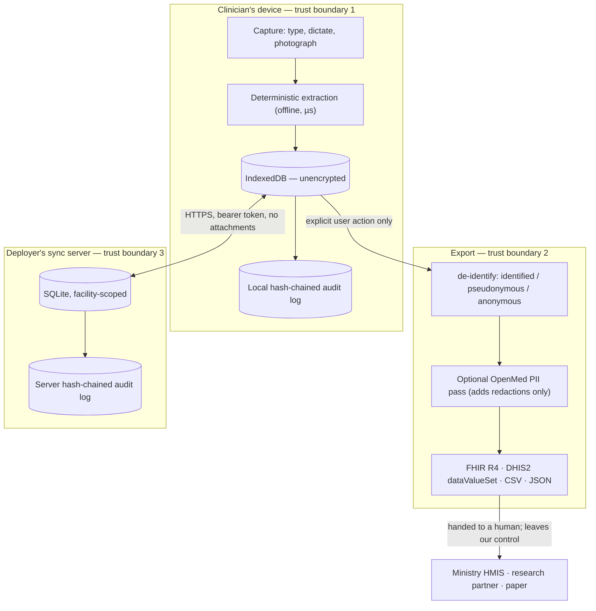

# Compliance

AfyaCore processes health data about identifiable people. Under every regime in
[§5](#5-country-regime-matrix) that is a *special category* of personal data,
and every one of them requires a documented assessment before it is processed at
scale. This is that document.

It is written for three readers, and it tries not to lie to any of them: a
facility administrator deciding whether to deploy this, a regulator asking what
was thought about, and a maintainer deciding whether a change makes things
worse.

> **Status.** Pilot candidate. No live deployment, no facility validation, and
> **no part of this document has been reviewed by a lawyer in any of the nine
> jurisdictions.** Every profile in the code ships `counselReviewed: false` and
> the app displays that to the administrator. Treat this as a serious first
> draft that names its own gaps, not as a compliance certificate.

| | |
|---|---|
| Covers | The PWA, the sync server and protocol, the export pipeline |
| Version | Against commit at time of writing; regenerate the matrix when `src/lib/countries.ts` changes |
| Companion documents | [SECURITY.md](../SECURITY.md) (controls and vulnerability reporting) · [README](../README.md#export-privacy) (export privacy) · [MODEL-RESEARCH.md](MODEL-RESEARCH.md) (model licensing) |

---

## 1. Who is the controller

This is the question that changes every other answer, and AfyaCore's
architecture makes it unusually clean.

**There is no vendor.** There is no AfyaCore-operated backend, no account
system, no telemetry, no analytics, no crash reporting, and no third-party
network call at runtime. The app is static files. The sync server is a Node
process a deployer runs on their own machine, storing to a SQLite file on their
own disk.

| Role | Who |
|---|---|
| **Data controller** | The health facility, or the ministry/NGO that operates it |
| **Data processor** | Nobody, in the default deployment. The controller runs the only server there is. |
| **Software supplier** | The AfyaCore project. Supplies code; never receives data. |
| **Data subjects** | Patients; and secondarily clinical staff, whose names and sign-in events are recorded |

Two consequences worth stating plainly:

- A deployer **cannot** discharge their obligations by pointing at us. There is
  no processor agreement to sign because there is no processor. Registration
  with the regulator, the lawful basis, the retention schedule and the breach
  response are all theirs.
- Equally, an AfyaCore compromise cannot exfiltrate patient data, because no
  path exists from a facility's device to us. The supply chain (§7.4) is the
  attack that would work, and it is treated as the serious one.

If a deployer hosts the sync server for facilities they do not themselves
operate — an NGO running one server for twenty clinics — then that NGO **is** a
processor for those facilities and needs the corresponding agreements. The
software does not know the difference; the deployer must.

---

## 2. Data inventory

### 2.1 On the device (IndexedDB, unencrypted)

| Store | Contents | Category |
|---|---|---|
| `patients` | Given and family name, sex, birth date or approximate age, phone, address, register number, preferred language | Identifying |
| `encounters` | Chief complaint, diagnosis, free-text notes, vitals, prescriptions, per-field provenance **including the raw dictation and OCR text** | Special category (health) |
| `attachments` | Photographs of paper records, as blobs, plus any OCR-extracted text | Special category (health), unredactable |
| `clinicians` | Staff name, role, PBKDF2-SHA256 PIN hash (600 000 iterations), sign-in times | Identifying (staff) |
| `audit` | Hash-chained log of who did what to which record, including `patient.view` | Identifying (staff + patient linkage) |
| `settings` | Facility country, sync server URL, device token, export salt, idle timeout | Configuration and secrets |

The **provenance** field deserves its own line. It stores the raw text a
clinician dictated or a photo produced, verbatim, so that a low-confidence
extraction can be traced back to what was actually said. It is therefore the
single richest source of stray identifiers in the record, and the
de-identifier scrubs it explicitly (§3.3).

### 2.2 On the sync server (SQLite, unencrypted)

`records` (patients and encounters, as JSON bodies, scoped by `facility_id`),
`facilities`, `enrolments` (hashed codes), `devices` (hashed bearer tokens), and
`audit`. **Attachments are never synced**, so no photograph of a paper register
ever reaches the server.

The server-side audit log records counts, never record contents — a sync entry
says "pushed 4, pulled 11", not what was in them. An audit log that duplicates
the clinical record doubles the blast radius of losing it.

### 2.3 What is never collected

No location, no device identifiers beyond a facility-scoped token the deployer
issues, no contact lists, no biometrics, no analytics identifiers, no
advertising identifiers, no crash telemetry.

---

## 3. Data flow

Four properties this diagram is meant to make checkable:

1. **Nothing leaves on its own.** Every arrow out of the device is behind an
   explicit user action or a sync server the deployer configured. The app makes
   no other outbound request at runtime. The one exception is a model download
   (OCR, or the optional PII model) that an administrator asks for.
2. **Every record-level export passes through one de-identification step.**
   There is no second path, so no export can bypass the level chosen.
3. **Attachments cross neither boundary 2 nor 3.** A photograph of a paper
   register cannot be redacted by any means we have, so it is excluded from
   sync and from every de-identified export.
4. **Once an export is handed over, it is gone.** We cannot recall it, expire
   it, or audit its onward use. That is why the de-identification level is a
   deliberate, logged choice and not a default.

### 3.1 Dictation — the one place audio leaves

The browser's Web Speech API is not local: in Chrome and Edge it streams
captured audio to the vendor's recognition service. A dictated consultation
therefore discloses the patient's **voice** — biometric data under several of
the regimes in §5 — along with their name and diagnosis, to a processor the
facility has no agreement with and this project does not control.

This was previously undisclosed, and both this document and SECURITY.md stated
the opposite. The correction:

- On-device recognition is requested every time, and used where the browser
  supports it (Chrome 138+ with the language pack). Then nothing leaves and
  nothing is asked.
- Otherwise dictation is **off** until an administrator acknowledges it. The
  acknowledgement is audited (`facility.configure`, `remoteDictation=…`), can
  be withdrawn, and a reminder stays on screen while it is in force.
- Typing is unaffected: offline, always available, never leaves the device.

A deployer relying on dictation needs this in their DPIA and, in most of these
regimes, a lawful basis for the transfer — which is a cross-border one, since
the recognition service is not in-country (§5.5).

### 3.2 Sync

Device enrolment uses a single-use code that expires in 24 hours, exchanged for
a bearer token stored as a hash. **Facility scope is a property of the token**;
a `facilityId` in the request body is ignored entirely rather than validated, so
there is no comparison to get wrong. Sync is push-then-pull against a
monotonic cursor. Soft deletes propagate as tombstones.

### 3.3 De-identification levels

| Level | What survives | Linkage |
|---|---|---|
| `identified` | Everything | n/a |
| `pseudonymous` | Age band (capped at 89), sex, clinical content | Stable code under a device-local salt: the same patient is recognisable across exports from this facility |
| `anonymous` | As above, dates generalised to the first of the month | Fresh salt per export: two exports cannot be joined |

Direct identifiers removed at both de-identified levels: given name, family
name, birth date, phone, address, register number, attachments.

### 3.4 Free-text scrubbing

Every free-text field — chief complaint, diagnosis, notes, **and the raw
provenance text** — is scrubbed against every identifier the roster holds:
names of *all* patients (not just this one), villages, register numbers, plus
country-specific phone patterns and a generic long-number rule.

Measured on the synthetic corpus (`npm run eval`): **100% of on-roster
identifiers removed, 0% of off-roster identifiers removed, 100% clinical
content retained.** The 0% is by construction — exact matching cannot reach a
name the device does not hold — and it is reported separately precisely so a
combined figure cannot hide it. That gap is what the optional OpenMed pass
exists to close, and **it has not been measured**: the model was never
downloadable in the development environment, so no inference has been run
(see [MODEL-RESEARCH.md](MODEL-RESEARCH.md) §4b).

---

## 4. DPIA

### 4.1 Why one is required

Health data, at scale, about a population with limited practical means of
redress. Every regime in §5 either mandates an impact assessment for
special-category processing or empowers the regulator to require one. It would
be needed on the merits regardless.

### 4.2 Necessity and proportionality

The alternative in the settings this targets is a paper register: no access
control, no audit trail, no redaction, and a copy nobody can revoke. The
question is not "digital versus nothing" but "digital versus paper", and on
confidentiality the honest answer is that digital is better on access logging
and worse on bulk exfiltration — one lost phone is a thousand records, one lost
register is one register.

That trade is why the design refuses several things it could easily have done:
no cloud account, no vendor backend, no telemetry, no analytics, no default
server. Data minimisation is structural rather than a policy: the app cannot
send what it has nowhere to send it to.

### 4.3 Risk register

Likelihood and impact are the deployer's to re-score for their own setting;
these are ours for a rural outpatient facility with shared devices.

| # | Risk | L | I | Mitigation in code | Residual |
|---|---|---|---|---|---|
| R1 | **Lost or stolen device is read** | High | High | PIN gate (PBKDF2, 600k iterations), 5-attempt lockout for 5 min, 15-min idle timeout | **High.** No encryption at rest (§6.1). An attacker with the device and time reads IndexedDB directly, without ever meeting the PIN screen. Relies entirely on OS full-disk encryption. |
| R2 | **Identifier leaks into a de-identified export via free text** | Med | High | Deterministic scrub over all roster identifiers, incl. provenance; phone patterns per country; over-inclusive by design | **Medium.** Off-roster names survive (measured 0% recall). The neural pass is unmeasured. |
| R3 | **Photograph of a paper register leaks** | Med | High | Attachments excluded from sync and from every de-identified export | Low, and deliberately achieved by refusing the feature rather than by redacting it |
| R4 | **Another facility's data is readable** | Low | High | Facility scope derived from the bearer token; body-supplied ids ignored; tested | Low |
| R5 | **Server disk is copied** | Med | High | Tokens and enrolment codes stored as hashes | **High.** Clinical records are plain text in SQLite. Relies on the deployer's disk encryption. |
| R6 | **Traffic intercepted** | Med | High | TLS supported via `AFYACORE_TLS_CERT`/`KEY`; the server warns on boot when running plain HTTP | **Deployer's.** Plain HTTP is the default and that is a real hazard on a shared network. |
| R7 | **Audit trail altered to hide access** | Low | Med | Hash chain on device and server; `cli.mjs audit:verify` reports the first break | **Medium.** A chain makes tampering detectable, not impossible: an administrator with filesystem access can rewrite the whole chain. Anchoring the head hash off-box is manual. |
| R8 | **Staff member browses records with no clinical reason** | Med | Med | `patient.view` is audited; roles restrict export, deletion, staff management | Medium. Detection only, and only if someone reads the log. |
| R9 | **Enrolment code intercepted (it travels by SMS or voice)** | Med | Med | Single-use, 24 h expiry, 10 attempts/min/address rate limit, ~38 bits of entropy | Low |
| R10 | **Patient asks for erasure and it is not honoured** | Med | Med | Attachment blobs are destroyed outright | **High.** For everything else, deletion is a tombstone, not erasure (§6.3). |
| R11 | **Data retained beyond its lawful period** | High | Med | Facility retention period, eligibility preview, audited purge on device and server | **Medium.** The mechanism exists on both sides; what remains unresolved is the *period*, which is `null` for most countries because we could not establish it from a primary source (§5.3). |
| R12 | **Processing has no valid lawful basis / consent** | High | High | Research consent recorded per patient and enforced inside `deidentify()`; absence is refusal | **Medium.** Secondary use is covered (§6.2). The lawful basis for the clinical record itself remains the deployer's to determine and document. |
| R13 | **Supply-chain compromise of the served bundle** | Low | Critical | No runtime third-party calls; models served from the deployer's own origin; SRI-free but same-origin | Medium. A compromised build reaches every facility at once, with no store review in between. |
| R14 | **Deleting a confirmed consultation changes a figure already reported** | Med | Low | Warned in the UI | Low, and an integrity rather than a privacy risk |

### 4.4 The four risks that block a real deployment

R10, R11, R12 and R1 are not "hardening"; they are the difference between a
demo and a lawful deployment. They are open, they are tracked in the repository,
and this document exists partly so they cannot be quietly forgotten:

- **R12 — consent and lawful basis.** No consent is recorded anywhere. A
  deployer relying on consent has no evidence of it; a deployer relying on a
  public-health task or vital interests needs that determination in writing.
- **R11 — retention.** Nothing expires. Records accumulate for the life of the
  device.
- **R10 — erasure.** `deletePatient` destroys the attachment blobs but sets
  `deletedAt` on the patient and every encounter, and it is the *tombstone*
  that syncs, not the removal. That is correct for convergence — a hard delete
  cannot propagate, so the other phone at the facility would keep a record this
  device believes is gone — and **wrong for a data-subject erasure request**,
  which wants the clinical content gone from both sides. Reconciling the two
  needs a real purge that propagates, not a change of flag.
- **R1/R5 — encryption at rest.** Explicitly out of scope for this milestone,
  and stated as a limitation rather than deferred silently.

---

## 5. Country regime matrix

Nine countries ship in `src/lib/countries.ts`. The statute and regulator are
recorded there and displayed in the app.

| | Country | Statute | Regulator | Breach deadline | Retention | Cross-border restricted |
|---|---|---|---|---|---|---|
| MG | Madagascar | Loi n°2014-038 | CMIL | Not established | Not established | Yes |
| SN | Sénégal | Loi n°2008-12 | CDP | Not established | Not established | Yes |
| CI | Côte d'Ivoire | Loi n°2013-450 | ARTCI | Not established | Not established | Yes |
| CD | RD Congo | Ordonnance-loi n°23/010 (Code du numérique) | Autorité de régulation du numérique | Not established | Not established | Yes |
| KE | Kenya | Data Protection Act, 2019 | ODPC | **72 h** (s.43(1)) | Not established | Yes |
| NG | Nigeria | Nigeria Data Protection Act, 2023 | NDPC | **72 h** (s.40(2); GAID 2025 art. 33(2)) | Not established | Yes |
| GH | Ghana | Data Protection Act, 2012 (Act 843) | Data Protection Commission | **Without delay** — "as soon as reasonably practicable" | Not established | Yes |
| TZ | Tanzania | Personal Data Protection Act, 2022 | PDPC | Not established — sources conflict | Not established | Yes |
| UG | Uganda | Data Protection and Privacy Act, 2019 | PDPO | **Without delay** — "immediately" (s.23, reg. 33) | Not established | Yes |

### 5.1 How to read "not established"

It means *find out*, never *no obligation*. A confidently wrong retention
period in a health system gets followed; an obviously absent one gets asked
about. The code enforces this: `retentionYears` is `null` and the app renders
"to confirm" rather than a plausible default.

### 5.2 The bug this table found

Uganda shipped as `breachNotificationHours: 72` and the app displayed "72 h" to
facility administrators. Uganda's DPPA s.23 and regulation 33 require
notification **immediately**, with no grace period. The app was telling an
administrator they had three days they did not have.

The interesting part is that 72 was not a typo. The field was `number | null`,
and in that shape "immediately" is inexpressible: `72` was the GDPR-shaped
default a reader reaches for, and `null` would have rendered as "to confirm",
which understates a *stricter* duty as an unknown one. The type was the bug.

It is now a three-state union — `{ kind: 'hours' }`, `{ kind: 'immediate' }`,
`{ kind: 'unestablished' }` — with tests naming Uganda and Ghana so the
regression cannot come back quietly.

Ghana moved for the same reason: Act 843 requires notification "as soon as
reasonably practicable", which is a duty, not a window.

### 5.3 Verification status

| Row | Basis | Confidence |
|---|---|---|
| KE breach 72 h | DPA 2019 s.43(1), consistent across primary text and commentary | Good |
| NG breach 72 h | NDPA 2023 s.40(2), restated in GAID 2025 art. 33(2). A 48 h figure circulates; it appears to come from sector-specific telecoms rules, not the general regime | Good, with a named ambiguity |
| UG "immediately" | DPPA 2019 s.23 and Data Protection and Privacy Regulations 2021 reg. 33 | Good |
| GH "as soon as reasonably practicable" | Act 843; commentary consistent | Moderate — section number not confirmed against the primary text |
| TZ | PDPA 2022 s.27(5) says "without undue delay"; separate commentary reports 72 h under the regulations. **Unresolved**, so recorded as unestablished | Poor |
| All Francophone rows | Statute and regulator names only. No breach or retention research done | Statute names only |
| All retention rows | Retention is generally set by health-sector rules rather than the data-protection statute, and varies by record type. None researched | None |

**No row has been reviewed by counsel in its jurisdiction, and none should be
relied on for a filing.** The purpose of this table is to be specific enough to
be *corrected*.

### 5.4 Before deploying in a country

1. Have local counsel read the row and set `counselReviewed: true` for it — the
   app displays a warning until they do.
2. Establish the retention period from health-sector rules, not the data
   protection statute.
3. Check whether the regulator requires registration of the controller, a DPO,
   or prior authorisation for health data.
4. Confirm the cross-border position before any export leaves the country
   (§5.5).

### 5.5 Cross-border transfer

Every one of the nine regimes restricts transferring personal data out of the
country. AfyaCore's architecture is unusually well placed here — there is no
foreign cloud, and the default deployment never transfers anything abroad —
but two paths need attention:

- **The sync server's location.** If a facility in Madagascar syncs to a VPS in
  France, that is a transfer, and it is the deployer's to justify.
- **Exports.** An anonymous export is, on most readings, no longer personal
  data and so outside the transfer rules. A **pseudonymous** export is still
  personal data, because the salt that reverses it exists on the device. Do not
  treat pseudonymous as anonymous.

---

## 6. Obligations and how far the code meets them

### 6.1 Security of processing

Implemented: device enrolment with expiring single-use codes, hashed bearer
tokens, facility scoping from the token, origin allow-listing, rate limiting,
PIN-gated sessions with lockout and idle timeout, role-based permissions, and
hash-chained audit logs on both sides. See [SECURITY.md](../SECURITY.md).

Not implemented: **encryption at rest**, on the device or the server. This is a
deliberate scope decision for this milestone, not an oversight, and it is the
largest single gap in the document. Both stores rely on OS-level disk
encryption.

### 6.2 Lawful basis and consent — **partially implemented**

The gap this document named as mattering most in practice is **secondary use**:
a patient consenting to treatment has not thereby consented to their record
leaving in a research export, even a de-identified one. That one is now closed.

Each patient carries a research-consent state — `granted`, `refused`, or
`notAsked` — recorded with a timestamp and the clinician who took it, and
audited as `consent.record`. It is enforced inside `deidentify()`, which is the
single point every record-level export passes through, so no export path can
bypass it. Patients who have not granted consent are removed from the file
along with their encounters, and the count travels in the export manifest:
a dataset that silently excludes a third of a catchment is biased in a way that
matters clinically, and a recipient cannot correct for a selection they were
never told about.

Three design points a reviewer should check:

- **Absence is refusal.** A patient with no recorded consent — including every
  patient created before the field existed — is excluded. A consent field
  whose absence reads as permission manufactures a record of agreement nobody
  gave.
- **Three states, not a boolean.** "We asked and they said no" and "nobody has
  asked" are different facts about a facility and only one is fixable by
  asking.
- **It does not gate care or statutory reporting.** An `identified` export is a
  clinical act — a referral, a handover, a copy for the patient — and the DHIS2
  monthly aggregate is a reporting obligation, not a disclosure a patient can
  opt out of. Blocking either to satisfy a rule about research would be the
  wrong trade in both directions.

**Still the deployer's:** determining and documenting the lawful basis for the
clinical record itself. In most of these regimes a public-health task or vital
interests is more workable than consent for treatment data. The app does not
and should not decide that.

### 6.3 Data-subject rights

| Right | Status |
|---|---|
| Access | Partial. The record is on screen and exportable; there is no "produce everything about this person" action. |
| Rectification | Partial. A correction overwrites the field; what is kept is the *fact* of an amendment after sign-off (`encounter.amend`, distinguished from `encounter.finalise`), not the previous value. Enough to answer "was this changed after it was signed", not enough to answer "to what". |
| **Erasure** | **Partial, and not in the sense a regulator means.** Attachment blobs — the photographs — *are* destroyed outright, because they never sync and nothing else needs to learn they are gone. The patient row and every encounter row survive as tombstones on the device and on the server, carrying their clinical content (R10). |
| Portability | Partial. FHIR R4 export is a genuinely portable format, but it is facility-level, not per-patient. |
| Objection / restriction | No mechanism. |

### 6.4 Retention — **implemented, manual**

A facility sets a retention period (Settings → Retention), defaulting to the
country profile's `retentionYears` and to *unset* where that is `null`, which is
most of the nine. **Unset means nothing is ever eligible**, so a period nobody
has established cannot cause a deletion.

An administrator sees the eligible count before anything happens and confirms
it. Purged rows are destroyed rather than tombstoned — this is the difference
from `deletePatient`, and the reason both exist.

A record is eligible only when all three hold:

| Condition | Why |
|---|---|
| Past the period, measured from the **encounter date** | Retention law counts from when care was given, not when the row was typed. A record back-entered from a paper register can already be expired. |
| `final`, never a draft | A draft is unfinished work, not a record; its age says nothing about whether it may be destroyed. |
| **Already synced** | Purging an unsynced record destroys the only copy. A phone offline for a month is the normal case here. |

The third is what makes an irreversible operation survivable. Records past the
period that cannot be purged for want of a sync are counted and shown
separately, because that is a backup problem rather than a retention one and
folding it into "kept" hides that the facility has records living on exactly
one device.

**It is deliberately not automatic.** A destructive operation on a timer, on a
device that may have the wrong date, in a facility whose retention period
nobody has confirmed with counsel, is a way to lose a year of consultations at
3am.

**The server is purged separately**, with `npm run admin retention:status` and
`retention:purge`. A device can only destroy its own copy, so a facility that
purges every phone and leaves the server holding the records has moved the data
rather than applied a policy. It is a separate deliberate command and not
something the sync protocol does on a device's say-so: a compromised or
misconfigured phone must not be able to tell the server to destroy a facility's
records. The server measures age on `updated_at`, the only timestamp it has,
which is later than the encounter date and therefore strictly more
conservative. Tombstones are purged too — a soft-deleted row still carries its
body, and letting deleted records outlive kept ones is the opposite of a
retention policy.

Both sides write `retention.purge` into the hash-chained audit log, inside the
transaction, so an entry can never describe a deletion that rolled back.

### 6.5 Breach response

The deployer's, entirely. What the software provides: `cli.mjs audit:verify`
establishes whether the server-side log has been altered and reports the first
break; `cli.mjs device:revoke` cuts off a lost device immediately; the app
displays the applicable deadline per country (§5).

What a deployer needs and the software does not provide: a named responsible
person, a route to the regulator, and a rehearsed procedure. Note the deadlines
that are **immediate** (Ghana, Uganda) — those leave no time to work out who to
call.

### 6.6 Accountability

Audit logs are hash-chained and cover sign-in, record access (`patient.view`),
creation, amendment, finalisation, deletion, merge, export, sync, account and
device management, and facility configuration. The chain head should be
recorded off-box periodically; that is not automated (R7).

---

## 7. Threat model

### 7.1 Assets

In priority order: patient clinical records; the patient roster (identifying
alone); attachment photographs (unredactable); the audit log (reveals who saw
whom); staff PIN hashes; device tokens and enrolment codes.

### 7.2 Adversaries

| Adversary | Capability | Primary path |
|---|---|---|
| Opportunistic thief | Physical device | R1 — read IndexedDB directly, bypassing the PIN |
| Curious insider | Valid credentials | R8 — browse records; detectable, not preventable |
| Malicious insider with server access | Filesystem | R5, R7 — read SQLite, rewrite the audit chain |
| Network attacker on a shared connection | Passive or active | R6 — plain HTTP by default |
| Someone targeting a specific patient | Motivated, may know staff | R8, R9 |
| Supply-chain attacker | Compromises build or hosting | R13 — reaches every facility at once |
| Research-data recipient | Holds an export | Re-identification of a pseudonymous export |

Explicitly **not** modelled: a state-level adversary with legal compulsion over
the deployer. Nothing in this architecture resists that, and claiming otherwise
would be dishonest.

### 7.3 Trust boundaries

1. **Device ↔ app.** The app trusts the OS. A rooted or malware-bearing phone
   defeats everything here; there is no attestation and none is planned.
2. **Device ↔ sync server.** Bearer token, facility-scoped. The server does not
   trust the client's claims about which facility it is. The client does trust
   the server's responses — a malicious server can serve wrong records into a
   facility, and nothing detects that today.
3. **Record ↔ export.** One de-identification step, no bypass. This is the
   boundary the test suite guards hardest.
4. **Project ↔ deployer.** We supply code and never receive data. This is the
   boundary that most limits our blast radius and most concentrates it in R13.

### 7.4 Supply chain

No runtime third-party network calls **except dictation**, which is disclosed
and off by default where it is not on-device (§3.4). A compromised CDN cannot
reach a facility. Models are vendored to the deployer's own origin by an explicit
script, never fetched from Hugging Face at runtime. `npm audit --omit=dev` is
clean; the development dependency `@huggingface/transformers` carries advisories
through Node-only transitive packages that never enter the browser bundle.

The residual risk is a compromised build or hosting: a PWA updates every device
immediately with no store review in between, which is a genuine benefit (§ "One
app, every device" in the README) and a genuine hazard in the same mechanism.

### 7.5 Re-identification of exports

A pseudonymous export of a small rural facility is not anonymous in any
practical sense: age band, sex, month and a diagnosis can be enough in a
catchment of a few hundred people. The `anonymous` level exists for this and
generalises dates and burns the linkage salt, but small-cell risk is not
eliminated by either level and no k-anonymity check is performed. A recipient
should be under an agreement not to attempt re-identification.

---

## 8. Deployment checklist

Before a first live patient, a deployer needs all of these. The code cannot
check any of them.

- [ ] Controller identified and registered with the regulator if required
- [ ] Lawful basis determined and documented; separate basis for any research use
- [ ] Retention schedule established from health-sector rules **and entered in Settings → Retention** (unset means nothing is ever deleted)
- [ ] Server-side purge scheduled alongside the device one (`npm run admin retention:purge`)
- [ ] Research consent recorded for patients whose records may be exported; staff trained that an unanswered consent excludes the record
- [ ] This DPIA reviewed and re-scored for the actual setting
- [ ] Country row reviewed by local counsel; `counselReviewed` set
- [ ] Sync server behind TLS (`AFYACORE_TLS_CERT`/`KEY`, or a terminating proxy)
- [ ] `allowedOrigins` set to the facility's own origin, never `*`
- [ ] Full-disk encryption enabled on every device and on the server
- [ ] Device screen lock enforced independently of the app's PIN
- [ ] Breach procedure written, with a named person and a route to the regulator
- [ ] Audit chain head recorded off-box on a schedule
- [ ] Staff trained that a de-identified export is still regulated data
- [ ] Lost-device procedure rehearsed (`cli.mjs device:revoke`)

---

## 9. Maintaining this document

Re-read it when any of these change: `src/lib/countries.ts` (§5),
`src/lib/deidentify.ts` (§3.2–3.3), the sync protocol (§3.1), the audit action
list (§6.6), or anything in the risk register.

Corrections to §5 are especially welcome and especially likely to be needed —
see [SECURITY.md](../SECURITY.md#reporting-a-vulnerability) for private
reporting, or open a normal issue for a legal correction, which is not a
vulnerability.
